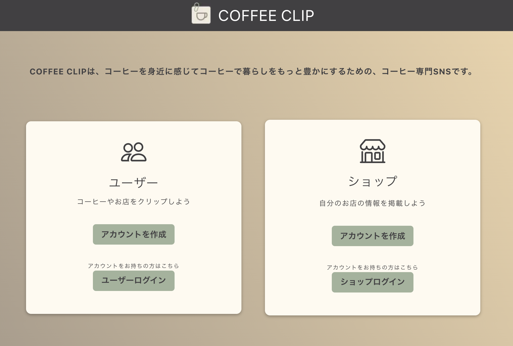

# COFEEE CLIP☕️

COFFEE CLIP は、コーヒーを身近に感じてコーヒーで暮らしをもっと豊かにするための、コーヒー専門 SNS です。  
[COFFEE CLIP](http://ec2-13-231-157-112.ap-northeast-1.compute.amazonaws.com/)



## コンセプト

コロナ禍でおうち時間が増えた人たちの間でコーヒーの需要が伸びており、また、以前から自宅でコーヒーを飲んでいる人の中には豆にこだわる人も多いので、コーヒーの情報を収集したり、発信する場を作りたいと考えました。

## 始め方

### インストール

1. このレポジトリをクローンして下さい

```sh
$ git clone https://github.com/ccj7/coffee-clip.git
```

2. 依存関係のインストール

```sh
// フロントエンド
$ cd front
$ npm i

// サーバーサイド
$ cd server
$ npm i
```

3. 以下のサンプルファイルをコピーして環境変数を設定します

```sh
// プロジェクト全体
$ cp .env.sample .env

// フロントエンド
$ cd front
$ cp .env.sample .env

// サーバーサイド
$ cd server
$ cp .env.sample .env
```

4. 開発環境は以下のコマンドで立ち上げてください

```bash
// フロントエンド
$ cd front
$ npm run dev

// サーバー
$ cd server
$ npm run dev
```

5. ビルドしたい場合は、以下のコマンドで実行できます

```bash
$ npm run build
```

## テストの実行方法

API サーバーにはテストを用意しています。以下のコマンドを実行してテストを行うことができます。

`/api/shops/` と `/api/users/` のエンドポイントに対してテストが行われます。

```
$ cd server
$ npm run test
```

## デプロイメント

1. デプロイしたいサーバーに COFFEE CLIP のソースをコピーします。
2. 以下のコマンドを使って COFFEE CLIP のアプリケーションを立ち上げることができます。

```
$ docker-compose build
$ docker-compose up
```

## テックスタック

- [Next.js](https://nextjs.org/) - フロントエンドフレームワーク
- [Firebase Authentication](https://firebase.google.com/docs/auth/) - ユーザー認証
- [Chakra UI](https://chakra-ui.com/) - UI コンポーネントライブラリ
- [Stripe](https://stripe.com/jp) - 決済システム
- [Express](http://expressjs.com/) - Web アプリケーション・フレームワーク
- [MongoDB](https://www.mongodb.com/) - データベース
- [mongoose](https://mongoosejs.com/) - ORM
- [Mocha](https://mochajs.org/) - テストフレームワーク
- [Chai](https://www.chaijs.com/) - アサーションフレームワーク

## Authors

テックリード:[Maho Miyata](https://github.com/mahomiyata)
フロントエンド:[Mei Omomo](https://github.com/mei-omomo) & [Nao Nomura](https://github.com/naonmr)  
バックエンド:[Maho Miyazawa](https://github.com/Maho-Miyazawa) & [Motoki Mizuno](https://github.com/Motoki-tech)
